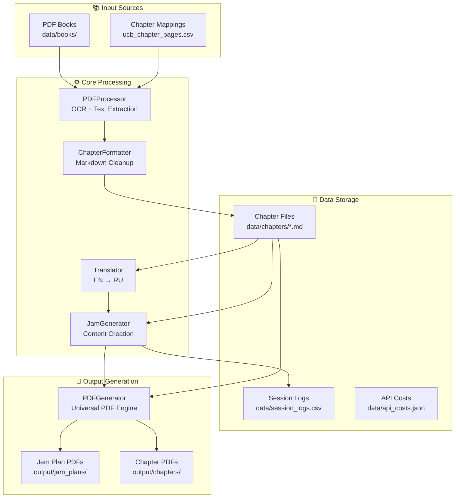
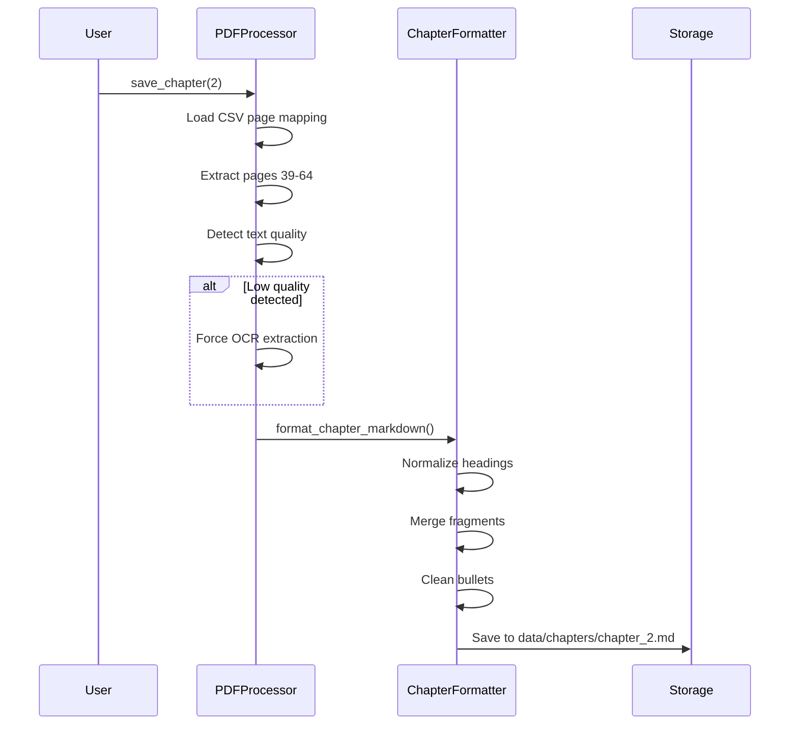
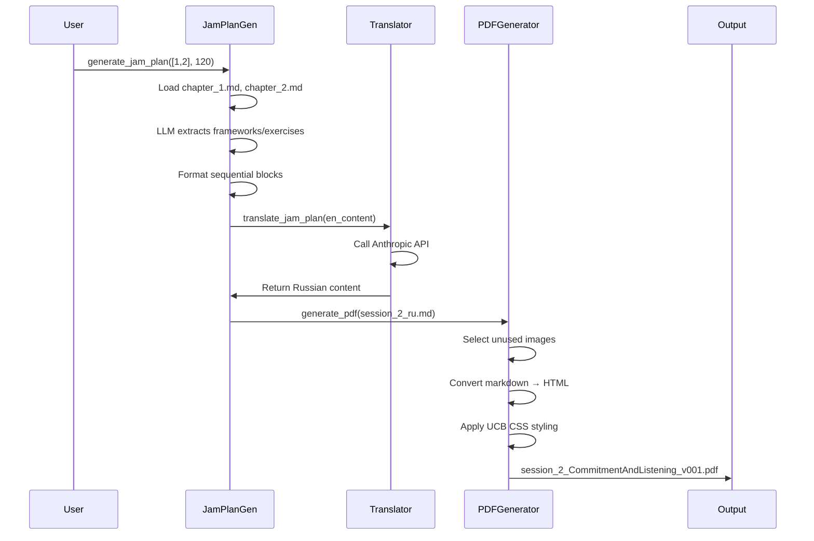

# Improv UCB - Architecture Overview

## System Purpose

A Python-based system for processing improv training books (specifically the Upright Citizens Brigade book), extracting chapters, and generating structured jam plans for improv training sessions. The system emphasizes direct text processing, bilingual support (English/Russian), and high-quality PDF generation.

---

## High-Level Architecture



---

## Directory Structure

```
improv_ucb/
├── src/                          # Core Python modules
│   ├── pdf_processor.py          # PDF extraction with OCR
│   ├── chapter_formatter.py      # Markdown cleanup & formatting
│   ├── jam_generator.py          # Jam plan content generation
│   ├── jam_plan_generator.py     # Jam plan orchestration
│   ├── pdf_generator.py          # Universal PDF generation
│   ├── translator.py             # EN→RU translation (Anthropic)
│   ├── cost_tracker.py           # API cost tracking
│   └── session_logger.py         # Session history logging
│
├── data/
│   ├── books/                    # Source PDF files
│   ├── chapters/                 # Extracted chapter markdown
│   │   ├── chapter_1.md          # English chapters
│   │   ├── chapter_1_ru.md       # Russian translations
│   │   └── ...
│   ├── ucb_chapter_pages.csv     # Chapter page mappings
│   ├── session_logs.csv          # Session history
│   └── api_costs.json            # API usage tracking
│
├── output/
│   └── jam_plans/                # Generated jam plan PDFs
│
├── assets/                       # Images for PDFs
│   └── *.jpg                     # UCB performance photos
│
├── scripts/                      # Utility scripts
│   ├── generate_pdf.py           # Universal PDF generator CLI
│   ├── generate_session_3.py     # Session-specific generators
│   └── ...
│
├── requirements.txt              # Python dependencies
├── README.md                     # System documentation
└── WORK_LOG.md                   # Development history
```

---

## Core Components

### 1. **PDFProcessor** (`src/pdf_processor.py`)

**Purpose:** Extract chapters from PDF books with intelligent OCR fallback

**Key Features:**
- **Dual extraction modes:** Standard pdfplumber + OCR (pytesseract) fallback
- **Quality detection:** Automatically detects garbled text and switches to OCR
- **Symbol soup detection:** Identifies corrupted spans (e.g., boxed exercises)
- **CSV-based page mapping:** Uses `ucb_chapter_pages.csv` for deterministic chapter boundaries
- **Configurable thresholds:** Tunable OCR trigger parameters

**Key Methods:**
- `save_chapter(chapter_num)` - Extract and save chapter to markdown
- `extract_chapter_from_map(chapter_num)` - Use CSV page ranges
- `_should_force_ocr(text)` - Detect low-quality extraction
- `_has_symbol_soup_span(text)` - Detect local corruption

**Configuration:**
```python
PDFProcessor(
    pdf_path="data/books/ucb.pdf",
    use_ocr=True,  # Enable OCR fallback
    auto_force_min_alpha=120,  # Min alphabetic chars for valid text
    auto_force_min_improvement=30  # OCR improvement threshold
)
```

---

### 2. **ChapterFormatter** (`src/chapter_formatter.py`)

**Purpose:** Clean and normalize extracted markdown for readability

**Key Features:**
- **Heading promotion:** Detect and promote major headings (e.g., "CHAPTER ONE")
- **Fragment merging:** Combine split lines and orphaned heading fragments
- **Bullet normalization:** Standardize list formatting
- **Unicode cleanup:** Convert curly quotes/dashes to ASCII
- **UCB-specific rules:** Remove repeated headers, fix common OCR errors

**Key Functions:**
- `format_chapter_markdown(raw_text, metadata)` - Main formatting pipeline
- `_promote_headings(lines)` - Detect and format major headings
- `_merge_fragmented_lines(lines)` - Combine split sentences
- `_reflow_paragraphs(lines)` - Join paragraph lines

**Example Transformations:**
```
Before: "is tong rorm" → After: "is Long Form"
Before: "VES...AND" → After: "YES...AND"
Before: "Let'S" → After: "Let's"
```

---

### 3. **Translator** (`src/translator.py`)

**Purpose:** Translate content to Russian using Anthropic Claude

**Key Features:**
- **Batch translation:** Process multiple entries in single API call
- **Context-aware:** Preserves improv terminology
- **Cost tracking:** Integrates with `CostTracker`
- **Selective translation:** Only translates missing fields

**Key Methods:**
- `translate_text(text, context)` - Translate single text
- `translate_jam_plan(plan_text)` - Translate full jam plan
- `translate_catalog_entries(entries)` - Batch translate catalog

**API Configuration:**
- Model: `claude-haiku-4.5` (fast, cost-effective)
- Max tokens: 4096
- Temperature: 0.3 (consistent translations)

---

### 4. **JamPlanGenerator** (`src/jam_plan_generator.py`)

**Purpose:** Orchestrate LLM-based jam plan creation from chapter content

**Key Features:**
- **Direct text processing:** Reads raw chapter markdown files
- **LLM-driven:** Uses Claude to analyze chapters and extract concepts/exercises
- **Bilingual output:** Generates plans in Russian or English
- **Automatic structuring:** Creates sequential blocks with theory + practice

**Key Methods:**
- `generate_jam_plan(chapter_nums, duration)` - Main orchestration
- `generate_plan_from_text(chapters, duration, language)` - LLM generation
- `_load_chapter_content(chapter_num)` - Load chapter markdown

**Workflow:**
1. Load chapter markdown files
2. Send to Claude LLM with structured prompt
3. LLM extracts frameworks and exercises
4. Format into sequential blocks
5. Save markdown and generate PDF via `PDFGenerator`

**LLM Configuration:**
- Model: `claude-3-5-sonnet-20241022`
- Max tokens: 4000
- Structured prompts for consistent output

---

### 5. **PDFGenerator** (`src/pdf_generator.py`)

**Purpose:** Universal markdown → PDF converter with UCB branding

**Key Features:**
- **Automatic versioning:** Never overwrites (e.g., `v001`, `v002`, `v003`)
- **Smart image placement:** Tracks usage, selects unused images
- **Content-aware naming:** `chapter_1_BaseReality_v001.pdf`
- **Professional styling:** Georgia typography, branded footers
- **WeasyPrint engine:** High-quality HTML → PDF rendering

**Key Methods:**
- `generate_pdf(input_file, content_type, theme_name)` - Main PDF generation
- `_enhance_content_with_images(content, content_type)` - Add images
- `_generate_output_path(input_file, theme_name)` - Versioned paths
- `_markdown_to_html(content, title)` - Convert with CSS styling

**Image Pools:**
- **Chapters:** `ucb_improv_training.jpg`, `the_big_team.jpg`, etc.
- **Jam Plans:** `bigger_show.jpg`, `asssscat_will_ferrell.jpg`, etc.

**Versioning Example:**
```
session_2_CommitmentAndListening_v001.pdf
session_2_CommitmentAndListening_v002.pdf  # Auto-incremented
session_2_CommitmentAndListening_v003.pdf
```

---

### 6. **SessionLogger** (`src/session_logger.py`)

**Purpose:** Track session history and feedback

**Key Features:**
- **CSV-based logging:** Human-readable format
- **Comprehensive tracking:** What worked, what didn't, timing issues
- **Recording integration:** Supports future audio/transcript paths
- **Retroactive logging:** Can log past sessions

**CSV Schema:**
```csv
SessionID, Date, JamPlanFile, Chapters, DurationMinutes, GroupSize,
FrameworksUsed, ExercisesUsed, WhatWorked, WhatDidntWork,
TimingIssues, ParticipantFeedback, FacilitatorNotes,
RecordingDate, RecordingPath, TranscriptPath
```

---

### 7. **CostTracker** (`src/cost_tracker.py`)

**Purpose:** Track Anthropic API usage and costs

**Key Features:**
- **Per-operation tracking:** Separate costs for extraction, translation, etc.
- **JSON storage:** `data/api_costs.json`
- **CSV export:** `data/api_costs.csv`
- **Token counting:** Input/output tokens per request

---

## Data Flow

### Chapter Extraction Flow



### Jam Plan Generation Flow



---

## Key Design Decisions

### 1. **Direct Text Processing (No Catalog)**
- **Decision:** Removed intermediate `catalog.csv` system
- **Rationale:** LLMs can work directly with chapter text, reducing complexity
- **Impact:** More flexible, less maintenance, faster iteration

### 2. **Markdown-First Workflow**
- **Decision:** Generate markdown files before PDFs
- **Rationale:** Easier review, version control, and iteration
- **Impact:** Clear separation of content creation vs. presentation

### 3. **OCR Fallback Strategy**
- **Decision:** Automatic quality detection with OCR fallback
- **Rationale:** PDF text extraction often fails on formatted boxes
- **Impact:** High-quality chapter extraction without manual intervention

### 4. **Automatic Versioning**
- **Decision:** Never overwrite PDFs, auto-increment versions
- **Rationale:** Preserve history for debugging and comparison
- **Impact:** Safe iterative development, easy rollback

### 5. **Bilingual Support**
- **Decision:** English source files, Russian translations
- **Rationale:** User's group is Russian-speaking, but source material is English
- **Impact:** Maintains source accuracy while serving target audience

---

## Technology Stack

### Core Dependencies
```
anthropic>=0.18.0       # Claude API for translation/extraction
pdfplumber>=0.10.0      # PDF text extraction
pytesseract             # OCR fallback (optional)
weasyprint>=60.0        # PDF generation
reportlab>=4.0.0        # Alternative PDF backend
python-dotenv>=1.0.0    # Environment variables
```

### External Requirements
- **Tesseract OCR:** Required for OCR fallback (`brew install tesseract`)
- **Anthropic API Key:** Required for translation and LLM features

---

## Configuration

### Environment Variables (`.env`)
```bash
ANTHROPIC_API_KEY=your_api_key_here
```

### Chapter Page Mappings (`data/ucb_chapter_pages.csv`)
```csv
unit_type,chapter_number,title,book_start,book_end,pdf_start,pdf_end
Chapter,1,Base Reality,18,37,19,38
Chapter,2,Commitment and Listening,38,63,39,64
Chapter,3,Character,64,87,65,88
```

---

## Usage Patterns

### 1. Extract a Chapter
```python
from src.pdf_processor import PDFProcessor

processor = PDFProcessor("data/books/ucb.pdf", use_ocr=True)
processor.save_chapter(2, output_dir="data/chapters")
# Output: data/chapters/chapter_2.md
```

### 2. Generate Jam Plan
```python
from src.jam_plan_generator import JamPlanGenerator

generator = JamPlanGenerator()
generator.generate_jam_plan(
    chapter_nums=[1, 2],
    duration=120,  # minutes
    output_file="output/jam_plans/session_2_ru.md"
)
```

### 3. Generate PDF
```bash
python scripts/generate_pdf.py \
    output/jam_plans/session_2_ru.md \
    --content-type jam_plan \
    --theme CommitmentAndListening
# Output: session_2_CommitmentAndListening_v001.pdf
```

### 4. Translate Content
```python
from src.translator import Translator

translator = Translator()
russian_text = translator.translate_jam_plan(english_text)
```

### 5. Log Session
```python
from src.session_logger import log_session_result

log_session_result(
    session_id="session_2",
    date="2025-11-23",
    chapters=[1, 2],
    what_worked="Three line scenes, object work",
    what_didnt_work="Feedback was too harsh"
)
```

---

## Current State (November 2025)

### ✅ Completed Features
- PDF extraction with OCR fallback
- Chapter formatting and cleanup
- Bilingual translation (EN→RU)
- Jam plan generation from chapters
- Universal PDF generation with versioning
- Session logging system
- API cost tracking
- Smart image management

### 📊 Content Status
- **Chapters extracted:** 1, 2, 3, Foreword
- **Russian translations:** Chapters 1, 2
- **Jam plans created:** Session 2 (Chapters 1-2)
- **Sessions logged:** 1 (retroactive)

### 🔧 Known Issues
- Chapter 2 boxed exercises may have OCR quality issues
- PDF generation scripts have some duplication (legacy)
- Image placement strategy needs refinement

### 🎯 Next Priorities
1. Refine Session 3 jam plan (Chapter 2 focus)
2. Improve image placement logic
3. Add exercise selection/filtering
4. Integrate session recordings/transcripts

---

## Architecture Strengths

✅ **LLM-Powered Generation:** Claude automatically extracts and structures content from chapters  
✅ **Direct Text Processing:** No intermediate database; works directly with markdown files  
✅ **Quality Focus:** OCR fallback ensures high-quality extraction  
✅ **Version Safety:** Automatic versioning prevents data loss  
✅ **Cost Awareness:** Built-in API cost tracking  
✅ **Bilingual Support:** First-class English/Russian support  
✅ **Extensibility:** Easy to add new books, languages, or output formats  

---

## Architecture Weaknesses

⚠️ **Manual Workflow:** Requires Cursor chat interaction (no standalone CLI)  
⚠️ **Image Placement:** Automatic but not content-aware  
⚠️ **Limited Testing:** No automated test suite  
⚠️ **Single Book Focus:** Optimized for UCB book specifically  
⚠️ **Legacy Code:** Some archived files remain for reference (see `/archive/`)  

---

## Future Enhancements

### Short-term
- Add content-aware image placement
- Improve exercise selection logic
- Add automated tests
- Create standalone CLI tool

### Medium-term
- Support for multiple books
- Recording/transcript integration
- Interactive CLI for jam plan generation
- Template system for common plan structures

### Long-term
- Web interface for plan generation
- Multi-language support beyond EN/RU
- Community-contributed exercise database
- AI-powered session feedback analysis
